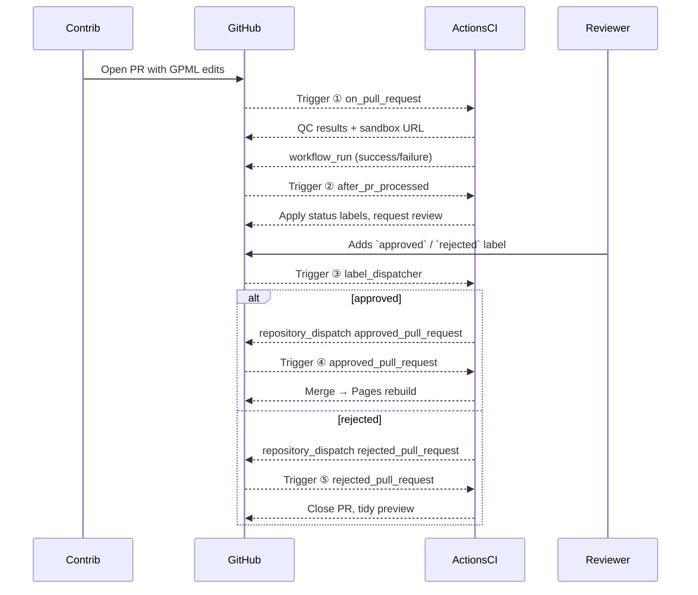

# Welcome to the WikiPathways Database SANDBOX
This repository is a sandbox version of the WikiiPathways database to develop new actions and procedures for pathway curation.

## General Usage
Users should never have to see this repo. If you think you're here by accident, maybe you are looking for the [WikiPathways Database](https://github.com/wikipathways/wikipathways-database).

## Development
Please use caution when commit directly to this repository. Various GitHub Action are triggered by new commits. Please review the workflows in the `.github/workflows` directory and ask other developers on Slack if uncertain before making changes.

### Update Protocol
The GitHub actions specifiy versions for various tools and resources. Developers are responsible for keeping these up-to-date. GitHub Actions will report pending deprecations on each run. Please take note of these and update the version numbers accordingly. These might include:
 * Node.js
 * Ubuntu _(consider using ubuntu-latest)_
 * Syntax for things like environment variables and secrets

 Marketplace actions also need to be updated. These might include:
 * actions/checkout
 * actions/setup-java
 * actions/setup-node
 * actions/setup-python
 * actions/cache
 * r-lib/actions/setup-r

 Finally, our own tools and resources will require updates. These might include:
 * meta-data-action jar
 * SyncAction jar
 * Caches of bridgedb files

## GitHub Migration Overview

WikiPathways has fully transitioned from MediaWiki + MySQL to a **GitHub‑native stack**:

| Layer | Legacy | New |
|-------|--------|-----|
| Data  | MySQL  | GPML files in `/pathways/` (version‑controlled) |
| UI    | MediaWiki | GitHub Pages + Jekyll ([live](https://github.com/wikipathways/wikipathways.github.io);[sandbox](https://github.com/wikipathways/sandbox-wp.gh.io))|
| Automation | Custom PHP bots | GitHub Actions (see _Actions Reference_) |

**How the pipeline works**

1. Contributors open a PR with pathway GPML changes.  
2. `1_on_pull_request` validates GPML, generates SVG/PNG previews, and deploys a sandbox site.  
3. Reviewers label the PR (`approved` / `needs‑work`).  
4. Dispatcher triggers either `3a_approved_pull_request` (merge + publish) or `3b_rejected_pull_request` (close + feedback).  
5. The live site auto‑rebuilds via Pages on merge.

See below for more details...

# GitHub Actions Reference

> This section explains every workflow, its event triggers, what each job does, required secrets, and how the workflows link together.

---

## 📜 Workflow Index
| ID | File | Trigger | Purpose |
|----|------|---------|---------|
| ① | `1_on_pull_request.yml` | `pull_request` targeting **`main`** (files under `pathways/` or `metadata/`) | Validate GPML, build previews, deploy sandbox, then fire a custom `pr_processed` event |
| ② | `2_after_pr_processed.yml` | `workflow_run` (from ①) | Add `status:` labels (`qc‑pass` / `qc‑fail`) & ping reviewers |
| ③ | `pr_label_dispatcher.yml` | `labeled` (labels: `approved` or `rejected`) | Convert reviewer labels into `repository_dispatch` events |
| ④ | `3a_approved_pull_request.yml` | `repository_dispatch` type `approved_pull_request` | Auto‑merge, update changelog, delete branch, trigger Prod site build |
| ⑤ | `3b_rejected_pull_request.yml` | `repository_dispatch` type `rejected_pull_request` | Post feedback comment, close PR, clean sandbox |

---

## 🔄 End‑to‑End Flow

---

## ① `1_on_pull_request.yml`
| Key | Value |
|-----|-------|
| **Event** | `pull_request`, types: `opened`, `synchronize`, `reopened` |
| **Runs‑on** | `ubuntu‑latest` |
| **Secrets** | `GPML_VALIDATOR_TOKEN`, `GH_PAT` |
| **Jobs** |
| `setup` → Install Java & PathVisio CLI |
| `lint`  → Run `gpml‑validator`, produce JSON report |
| `convert` → GPML ➜ RDF & JSON via PathVisio, zip artifacts |
| `preview` → Build Jekyll sandbox (`--baseurl /sandbox/<PR#>`), deploy to `gh-pages` branch using `peaceiris/actions-gh-pages` |
| `report`  → Comment on PR with ✔/✖ status & preview link |
| `dispatch` → `repository_dispatch` with `event_type: pr_processed` and `conclusion` payload |

### Failure modes
* **GPML lint errors** – job fails, conclusion = `failure` → reviewer label `qc‑fail`.

---

## ② `2_after_pr_processed.yml`
| Key | Value |
|-----|-------|
| **Event** | `workflow_run` (from ①), branches: `main` |
| **Filter** | `workflow_run.workflow == '1_on_pull_request'` |
| **Jobs** |
| `label` → Uses `peter-evans/workflow-dispatch` to add `qc‑pass` or `qc‑fail` depending on `conclusion` |
| `request_review` → If pass, assign code owners as reviewers |

---

## ③ `pr_label_dispatcher.yml`
| Key | Value |
|-----|-------|
| **Event** | `pull_request_target` on `labeled` |
| **Labels Watched** | `approved`, `rejected` |
| **Job** | Single step: `curl -X POST` → `repos/:owner/:repo/dispatches` with `event_type` set to `approved_pull_request` or `rejected_pull_request` and payload `{ "pr": <number> }` |

⚠️ **Security note:** `pull_request_target` runs in the context of the base repo. The job therefore uses minimal token permissions (`contents: write`, `pull-requests: write`) and verifies that the acting user is a member of `@wikipathways/reviewers`.

---

## ④ `3a_approved_pull_request.yml`
| Key | Value |
|-----|-------|
| **Event** | `repository_dispatch` with `event_type == approved_pull_request` |
| **Inputs** | `pr` number |
| **Jobs** |
| `merge` → Checkout PR head, rebase onto `main`, push
| `release_notes` → Append line to `CHANGELOG.md` (`npm version-prerelease`)
| `cleanup` → Delete source branch
| `comment` → Congratulatory note with commit SHA & live URL

---

## ⑤ `3b_rejected_pull_request.yml`
| Key | Value |
|-----|-------|
| **Event** | `repository_dispatch` with `event_type == rejected_pull_request` |
| **Jobs** |
| `comment` → Post template feedback pointing to failed QC log or reviewer remarks |
| `close`   → `gh pr close --delete-branch` |
| `sandbox_cleanup` → Remove preview site directory via API |
